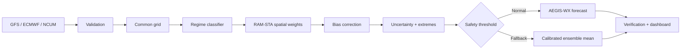

# AEGIS-WX

**Adaptive Hybrid AI–NWP Multi-Model Forecast Blending System** — a runnable Smart India Hackathon prototype for SIH26081.

> **DEMO MODE — Synthetic Hindcast Data.** All benchmark values shown by this prototype are calculated against generated synthetic truth fields. They are not operational meteorological performance claims.

## What it demonstrates

AEGIS-WX accepts GFS, ECMWF and NCUM-style forecast fields, validates and harmonises them, detects a weather regime, calculates per-cell/lead softmax weights, blends, calibrates, estimates model-disagreement uncertainty, applies an explicit safety fallback, and verifies outputs against truth. It does not use a global average.



## Project tree

```text
app.py                 Streamlit dashboard
api/main.py            FastAPI endpoints
core/                  config, schemas, logging
data/                  synthetic engine, validation, real-data adapter design
models/                regime, RAM-STA, calibration, uncertainty, fallback
inference/pipeline.py  end-to-end runnable pipeline
verification/          measured metrics and export
training/              chronological synthetic-hindcast commands
tests/                 pytest suite
```

## Install and run

Python 3.11–3.13 is recommended; the code deliberately keeps PyTorch optional so the CPU demo works when a matching Torch wheel is not yet available.

```powershell
python -m pip install -r requirements.txt
streamlit run app.py
```

Open the local Streamlit address printed in the terminal. Click **Run AEGIS-WX**; switch scenario seed or choose a manual regime to demonstrate adaptive behaviour. The dashboard includes map layers, spatial weight maps, uncertainty/confidence, extreme counts, point series, exported verification CSV/report and a NetCDF download when xarray is installed.

## Commands

```powershell
# End-to-end demo
python -m inference.pipeline --regime MONSOON

# Tests
python -m pytest -q

# Chronological 70/15/15 synthetic hindcast benchmark
python -m training.train_blender
python -m training.train_regime

# API, then visit http://127.0.0.1:8000/docs
python -m uvicorn api.main:app --reload
```

## Methodology

The synthetic generator covers NORMAL, MONSOON, CYCLONE, HEATWAVE and WESTERN_DISTURBANCE patterns over a reduced 1° India grid. Each source receives differing systematic spatial bias, smooth correlated error, lead-time degradation, and regime-specific error amplitudes. `RAMSTABlender` combines regime priors, local disagreement, spatial texture and lead time then normalises with softmax. The invariant `sum(model weights) = 1` is unit tested.

Bias correction uses actual hindcast residual bias, not a fixed claimed gain. Uncertainty is a normalised weighted ensemble disagreement plus the measured residual standard deviation. Its cell-level high values trigger a visible calibrated-mean fallback. Continuous RMSE/MAE, threshold CSI and ROC-AUC are calculated fresh for GFS, ECMWF, NCUM, simple mean and AEGIS-WX.

## Real data mode

`GFSAdapter`, `ECMWFAdapter`, and `NCUMAdapter` expose `load_forecast`, `validate`, `normalize`, and `regrid`. They open NetCDF with xarray or GRIB/GRIB2 via `cfgrib` when the optional `eccodes` stack is installed. Missing or malformed source input returns a clearly labelled **DEMO MODE** fallback; it never purports to be live data. Production can replace the regular-grid interpolation abstraction with xESMF/ESMF conservative remapping.

## API

`GET /health`, `GET /models`, `POST /forecast`, `POST /blend`, `POST /verify`, `GET /regime`, `GET /weights`, and `GET /uncertainty` are provided. Interactive API documentation is served by FastAPI at `/docs`.

## Limitations and next work

This is a CPU-first prototype, not an operational forecast system: the fields and truth are synthetic; regime scoring is a transparent rule baseline; the NumPy RAM-STA implementation is the fast demonstrator while optional PyTorch encoder/temporal modules provide the training extension point; and full operational GRIB normalisation, xESMF, station assimilation, data licensing, alert policy and real historical verification need real inputs and validation. The config uses 1° for quick laptops; use finer grids only with suitable memory/data infrastructure.
